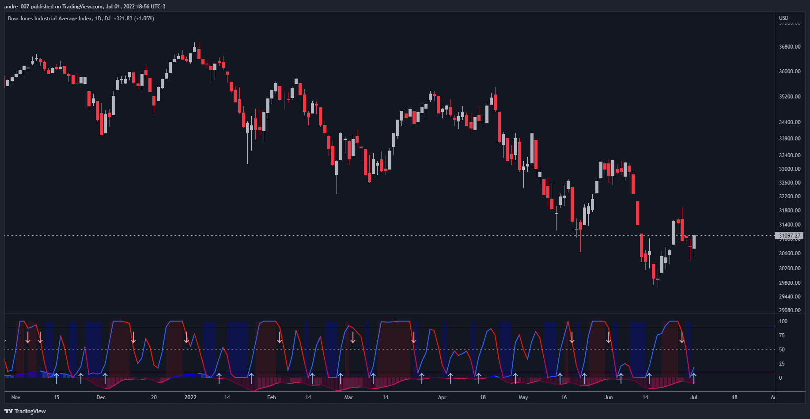

# █ DMI Stochastic Extreme Refurbished

DMI Stochastic Extreme was originally published by Barbara Star, PhD , in TASC magazine of January 2013.
Basically it describes an improved version of the ADX DI+/DI- indicator, created by J. Welles Wilder.

In the setup described by the author, the DMI Oscillator is used together with a stochastic oscillator of DMI.
First, the DMI Oscillator is obtained by subtracting the minus directional movement indicator value (DI-) from the plus directional movement value (DI+).
The final result is the "DMI Stochastic Extreme" indicator, in which the stochastic oscillator is calculated. Only instead of using the price value, the stochastic is obtained through the DMI value.

## █ Goals

The final indicator described by Barbara is the Stochastic Oscillator of DMI.
However, to use the DMI oscillator together (as described in the magazine), it is necessary to plot it in a separate indicator, which consumes screen space.
That's why the idea of ​​joining both the DMI oscillator and the DMI Stochastic Oscillator into one thing came up, optimizing the visualization.
Taking advantage of the fact that my hands are already dirty :), I created some fine adjustments.

## █ HOW TO USE IT

Here are some examples:

1. With default params:

2. With custom DI Length of 21 (Histogram), DI Length of 13 (for Stoch Oscilator), Stoch Length of 5, and another theme.

3. Another params with less noise:
snapshot

4. Others:

## █ THANKS AND CREDITS

- Barbara Star (original creator)
- ucsgears (arrow logic)

## █ DONATIONS

- BTC: 1PnerhP2C5xeGXxAkhxQX4rYrBUguGe1yh
- LTC: LMhAfkzJoUHHWfFCcMnnQ4jdV4Vi9WZG3W
- Stellar: GCPONJ5OX7KSEHBNPB2SKJZJGYSXTRN7ORYQXW443BLEFLS72ZVYISG2
- Zcash: t1THe8JvsYqt7bmbFWkFpjssJhJLka6VAhk
- Tron: TSVnEgtoYhRMwiRYfDFC51XfGNSpxse2yz
